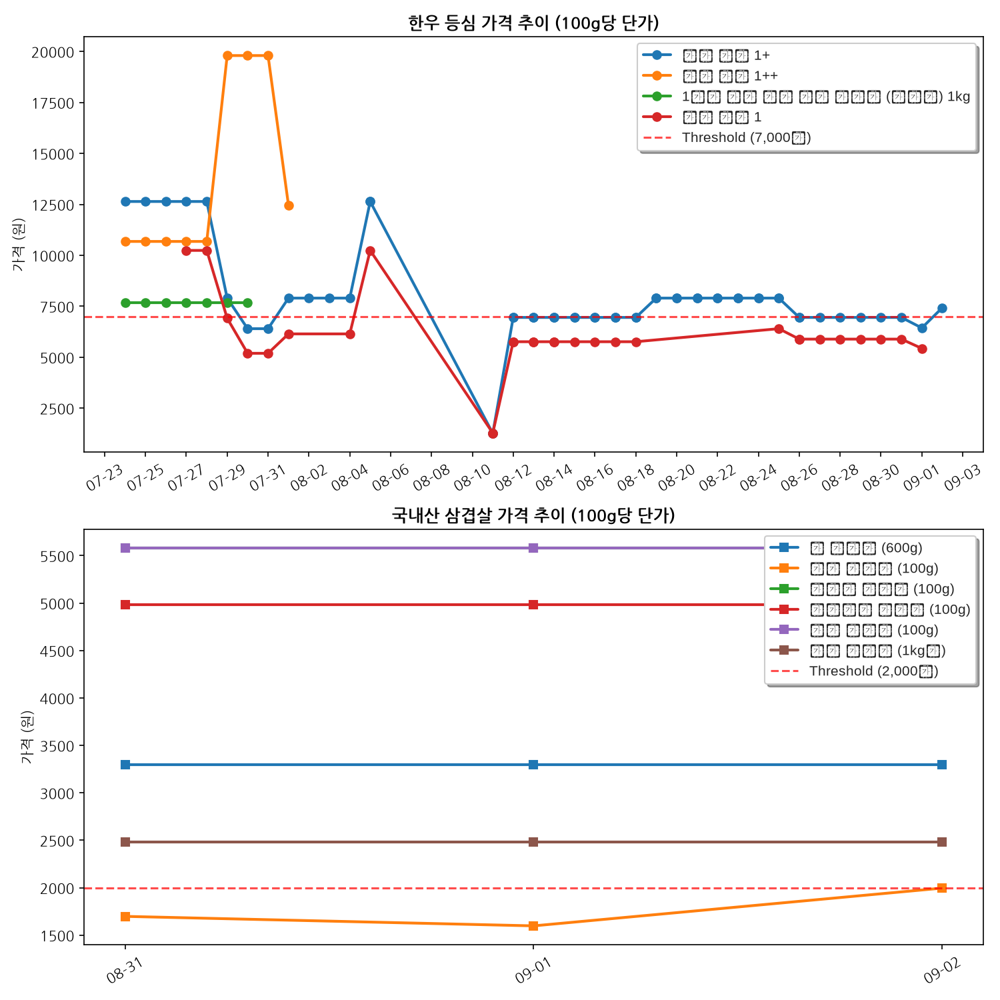

# Naver Booking & Megamart Price Monitor

이 저장소는 네이버 예약 및 메가마트 가격 감시 모니터링 시스템을 위한 자동화 저장소입니다.

---

## 🥩 메가마트 소고기(한우 등심) & 돼지고기(국내산 삼겹살) 실시간 추이
* **설정 가격 기준**: 소고기 100g당 **7,000원 이하** / 돼지고기 100g당 **2,000원 이하**일 때 이메일 알림 발송

### 📌 최근 수집된 가격
- **한우 등심 1+등급 구이용 (국내산) 100g**: 100g당 7,426원 (현재 판매가: 7,426원/100g) (업데이트: 2026-09-02)
- **꽃 삼겹살 (600g)**: 100g당 3,300원 (현재 판매가: 19,800원/600g) (업데이트: 2026-09-02)
- **돼지 삼겹살 (100g)**: 100g당 1,996원 (현재 판매가: 1,996원/100g) (업데이트: 2026-09-02)
- **흑돼지 삼겹살 (100g)**: 100g당 5,580원 (현재 판매가: 5,580원/100g) (업데이트: 2026-09-02)
- **포크밸리 삼겹살 (100g)**: 100g당 4,980원 (현재 판매가: 4,980원/100g) (업데이트: 2026-09-02)
- **제주 삼겹살 (100g)**: 100g당 5,580원 (현재 판매가: 5,580원/100g) (업데이트: 2026-09-02)
- **돼지 삼겹살 (1kg팩)**: 100g당 2,480원 (현재 판매가: 24,800원/1000g) (업데이트: 2026-09-02)

### 📈 가격 추이 그래프

---

## 📅 네이버 예약 모니터링 (애슐리퀸즈 여의도한강공원점)
* **대상 일자**: 2026년 8월 15일 광복절 (프로젝트 종료)
